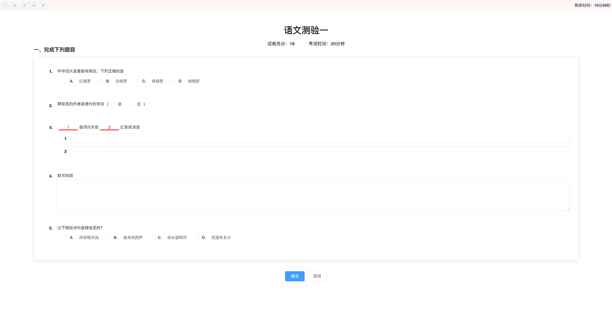
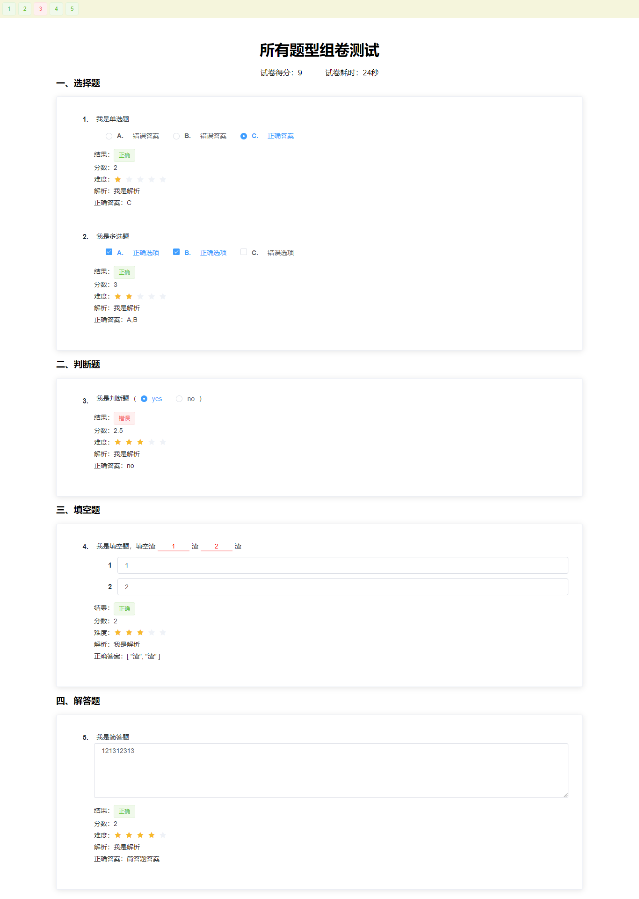
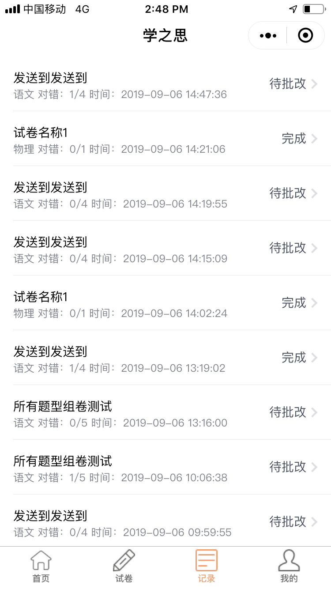
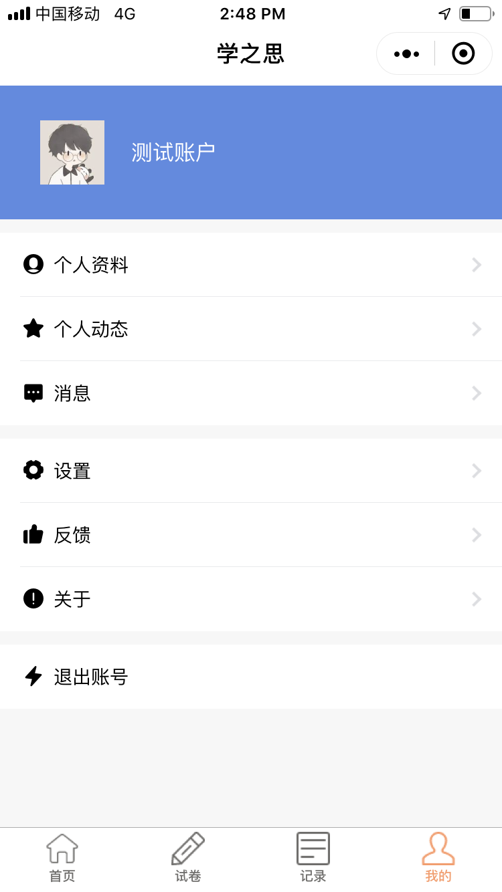
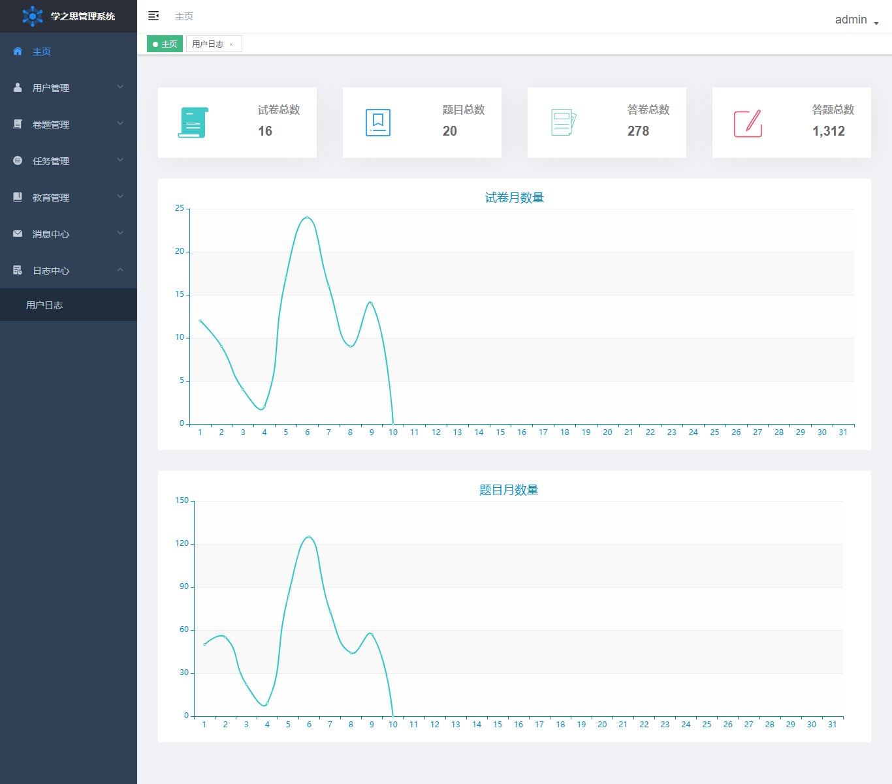

<a href="https://www.mindskip.net" target="_blank">
 
<a/>

 

 
 
 

# 学之思开源考试系统 - Postgresql版

## 项目介绍

学之思开源考试系统是一款 java + vue 的前后端分离的考试系统。主要优点是开发、部署简单快捷、界面设计友好、代码结构清晰。支持web端和微信小程序，能覆盖到pc机和手机等设备。
支持多种部署方式：集成部署、前后端分离部署、docker部署。

### 演示地址

* 官网：[https://www.mindskip.net](https://www.mindskip.net)
* 学之思开源考试系统：[https://www.mindskip.net/xzs.html](https://www.mindskip.net/xzs.html)

### 商业版考试系统

* 思多多智能考试系统：[https://www.mindskip.net/sdd.html](https://www.mindskip.net/sdd.html)
* 维多多培训考试系统：[https://www.mindskip.net/wdd.html](https://www.mindskip.net/wdd.html)
* 学多多教育考试系统：[https://www.mindskip.net/xdd.html](https://www.mindskip.net/xdd.html)

### 学之思交流群(加群获取数据库脚本)

* QQ交流群⑪：`626073476`
* 商务QQ：`2732007709`
* 商务微信：`mind_skip`
* 商务邮箱：`mindskip@qq.com`

### 学之思仓库版本地址

* gitee - postgresql ：[https://gitee.com/mindskip/uexam](https://gitee.com/mindskip/uexam)
* gitee - mysql ：[https://gitee.com/mindskip/xzs-mysql](https://gitee.com/mindskip/xzs-mysql)
* github - postgresql ：[https://github.com/mindskip/xzs](https://github.com/mindskip/xzs)
* github - mysql ：[https://github.com/mindskip/xzs-mysql](https://github.com/mindskip/xzs-mysql)

### 开发部署文档教程

* [https://www.mindskip.net:888](https://www.mindskip.net:888)

### 开发部署视频教程

* [https://www.mindskip.net:888/guide/video.html](https://www.mindskip.net:888/guide/video.html)

### 学生系统功能

* 登录、注册： 注册时要选年级，过滤不同年级的试卷， 账号为：student/123456
* 首页： 任务中心、固定试卷、时段试卷、试卷可以重复做
* 试卷中心： 包含了所有能做的试卷，按学科来过滤和分页
* 考试记录： 所有的试卷考试记录在此处分页，可以查看试卷结果、用时、得分、自行批改等
* 错题本： 所有做错的题目，可以看到做题的结果、分数、难度、解析、正确答案等
* 个人中心： 个人日志记录
* 消息： 消息通知
* 试卷答题和试卷查看： 展示出题目的基本信息和需要填写的内容

### 管理系统功能

* 登录： 账号为： admin/123456
* 主页： 包含了试卷、题目、做卷数、做题数、用户活跃度的统计功能，活跃度和做题数是按月统计
* 用户管理： 对不同角色 学生、管理员 的增删改查管理功能
* 卷题管理：
    1. 试卷列表：试卷的增删改查，新增包含选择学科、试卷类型、试卷名称、考试时间，试卷内容包含添加大标题，然后添加题目到此试卷中，组成一套完整的试卷
    2. 题目列表：题目的增删改查，目前题型包含单选题、多选题、判断题、填空题、简单题，支持图片、公式等。
* 任务管理：对任务进行修改
* 教育管理：对不同年级的学科进行增删改查
* 答卷管理：查看学生成绩
* 消息中心：可以对多个用户进行消息发送
* 日志中心：用户的基本操作进行日志记录，了解用户使用过情况

### 小程序功能

* 用户登录登出功能，登录会自动绑定微信账号，登出会解绑
* 首页包含任务中心、固定试卷、时段试卷，和web端保持一致
* 试卷模块，固定试卷和时段试卷的分页查询，下拉加载更多，上拉刷新当前数据
* 记录模块，考试结果的分页，包含了试卷基本信息
* 我的模块，包含个人资料的修改，个人动态，消息中心模块

### 系统展示

* 学生考试系统
<table>
    <tr>
        <td></td>
        <td></td>
    </tr>
</table>

*  小程序考试系统
<table>
    <tr>
        <td></td>
        <td></td>
        <td></td>
        <td></td>
    </tr>
    <tr>
        <td></td>
        <td></td>
        <td></td>
        <td></td>
    </tr>
</table>

* 后台管理系统

<table>
    <tr>
        <td></td>
        <td></td>
    </tr>
</table>