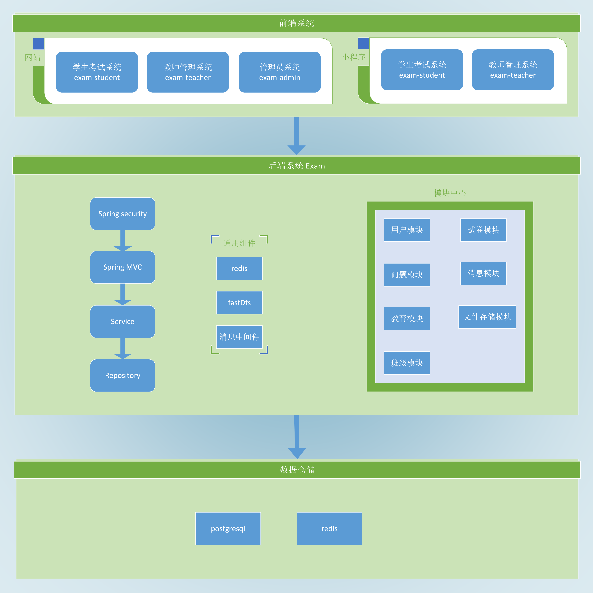
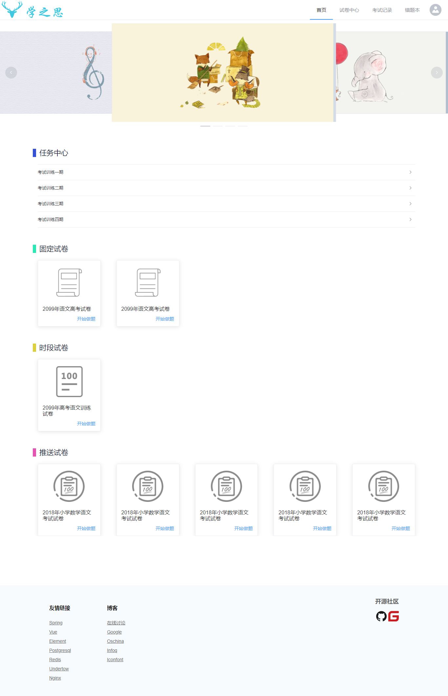
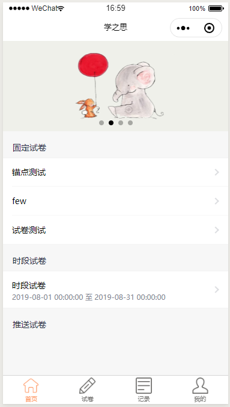
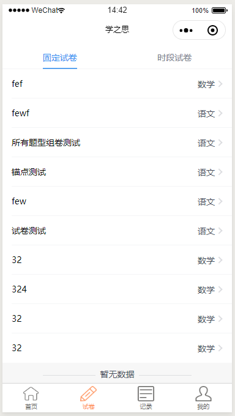
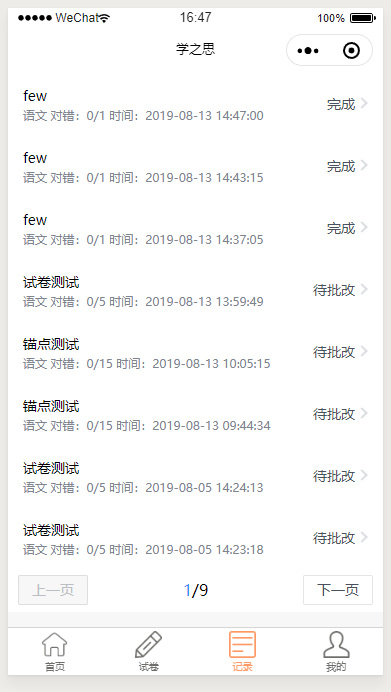
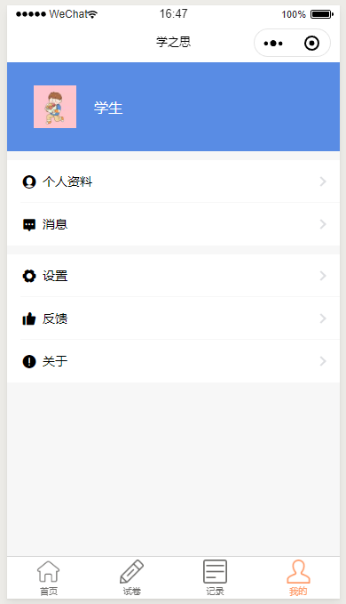
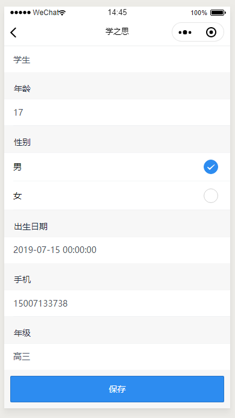
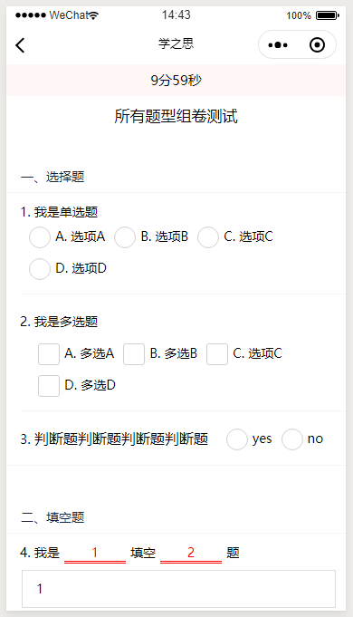
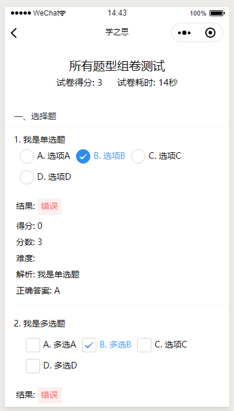
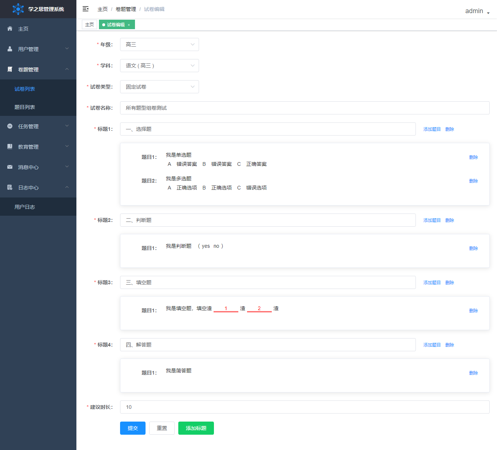

# 学之思考试系统

#### 介绍
学之思考试系统是一款基于k12教育的考试平台，小学、初中、高中和不同学科均可以均可以使用，支持各种题型(单选、多选、判断、填空、解答)，里面包含了三大系统：学生系统、教师系统(TODO)、管理员系统、微信小程序学生考试系统

演示地址:  
   1. https://www.alvisu.com       官网
   2. http://student.alvisu.com   学生系统
   3. http://admin.alvisu.com     管理系统

小程序：

源码地址：
   1. https://gitee.com/alvis-yu/uexam       gitte   postgresql版本
   2. https://gitee.com/alvis-yu/uexam-mysql  gitte   mysql版本
   3. https://github.com/alvis-u/uexam        github  postgresql版本
   4. https://github.com/alvis-u/uexam-mysql  github  mysql版本

学生系统模块：
* 登录、注册： 注册时要选年级，过滤不同年级的试卷， 账号为student/123456
* 首页： 任务中心、固定试卷、时段试卷、推送试卷(TODO)，可以能做的一部分试卷
* 试卷中心： 包含了所有能做的试卷，按学科来过滤和分页
* 考试记录： 所有的试卷考试记录在此处分页，可以查看试卷结果、用时、得分、自行批改等
* 错题本： 所有做错的题目，可以看到做题的结果、分数、难度、解析、正确答案、扩展练习(TODO)等
* 个人中心： 个人日志记录
* 消息： 消息通知 
* 试卷答题和试卷查看： 展示出题目的基本信息和需要填写的内容

管理系统模块：
* 登录： 账号为 admin/123456
* 主页： 包含了试卷、题目、做卷数、做题数、用户活跃度的统计功能，活跃度和做题数是按月统计
* 用户管理： 对不同角色 学生、教师、管理员 的增删改查管理功能
* 卷题管理：
    1. 试卷列表：试卷的增删改查，新增包含选择学科、试卷类型、试卷名称、考试时间，试卷内容包含添加大标题，然后添加题目到此试卷中，组成一套完整的试卷
    2. 题目列表：题目的增删改查，目前题型包含单选题、多选题、判断题、填空题、简单题，支持图片、公式等。
* 教育管理：对不同年级的学科进行增删改查
* 消息中心：可以对多个用户进行消息发送，预留：加入班级，推送试卷等消息
* 日志中心：用户的基本操作进行日志记录，了解用户使用过情况

小程序学生系统：
* 用户登录登出功能，登录会自动绑定微信账号，登出会解绑
* 首页包含任务中心、固定试卷、时段试卷、推送试卷模块，和web端保持一致
* 试卷模块，固定试卷和时段试卷的分页查询，下拉加载更多，上拉刷新当前数据
* 记录模块，考试结果的分页，包含了试卷基本信息
* 我的模块，包含个人资料的修改，个人动态，消息中心模块

#### 软件架构
系统采用了前后端分离技术,学生、教师、管理员系统前台均使用vue.js, 后台使用spring boot

后端技术栈列表：
* spring-boot  2.1.6.RELEASE
* spring-boot-security 用户登录验证 
* undertow  web容器 
* postgresql/mysql 优秀的开源数据库
* redis 缓存，提升系统性能
* mybatis 数据库中间件
* hikari 速度最快的数据库连接池
* 七牛云存储 目前10G内免费

前端技术栈列表：
* Vue.js  采用新版，使用了vue-cli3搭建的系统，减少大量配置文件
* element-ui  最新版
* vue-element-admin 最新版，对该系统做了大量精简，只保留了部分样式和控件
* echarts 图表统计
* ueditor 为了支持填空题，做了部分修改

#### 软件架构图

#### 安装教程
1. redis 安装
2. postgresql/mysql 安装后执行/exam/database下的数据库脚本，创建表初始化数据
3. 下载好源码，
   1. /exam/source/exam为后台代码，建议使用IntelliJ IDEA打开，在application-dev.yml文件中，配置好postgesql、redis、fdfs的服务地址，打开ExamApplication文件编译运行。
   2. /exam/source/vue下为学生端、管理员端的前端代码，建议使用JetBrains WebStorm打开，使用命令：npm run serve即可编译代码

#### 系统展示

1. 学之思考试系统

<table>
    <tr>
        <td></td>
        <td></td>
    </tr>
</table>

2 .小程考试系统

<table>
    <tr>
        <td></td>
        <td></td>
        <td></td>
        <td></td>
    </tr>
    <tr>
        <td></td>
        <td></td>
        <td></td>
        <td></td>
    </tr>
</table>

3.学之思管理系统

<table>
    <tr>
        <td></td>
        <td></td>
    </tr>
</table>

#### 后续更新计划
* 修复小程序bug
* 完成扩展训练模块，错题本试卷扩展
* 完成教师系统，统计图，试卷管理，试卷批改，学生管理，班级管理，班级试卷(推送试卷)

#### 学之思交流群
   QQ群：  点击链接加入群聊【学之思交流群】

### 喜欢的朋友请star一下，你的star是我后续更新的动力！！
     