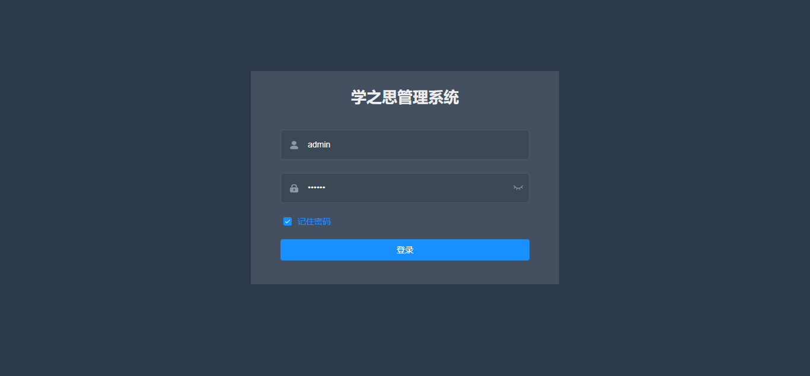
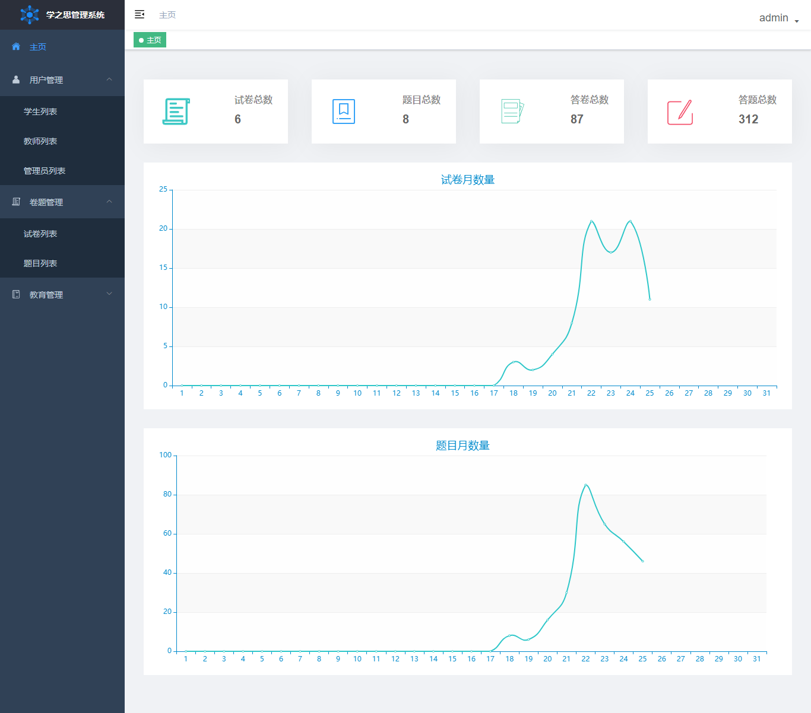
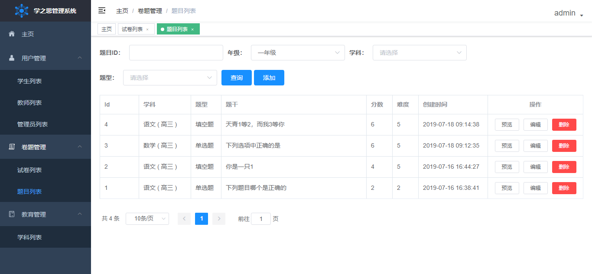
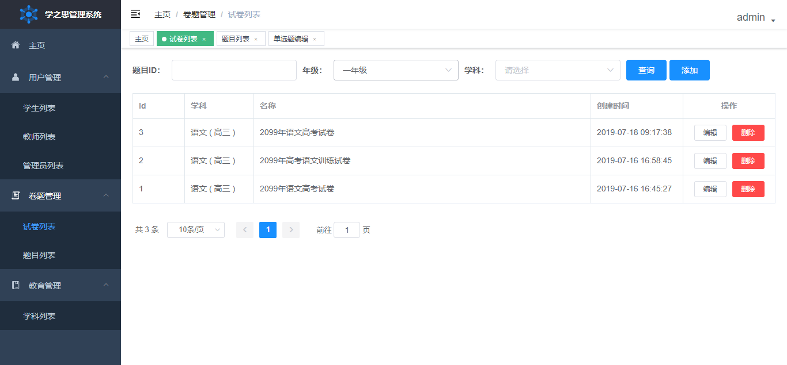
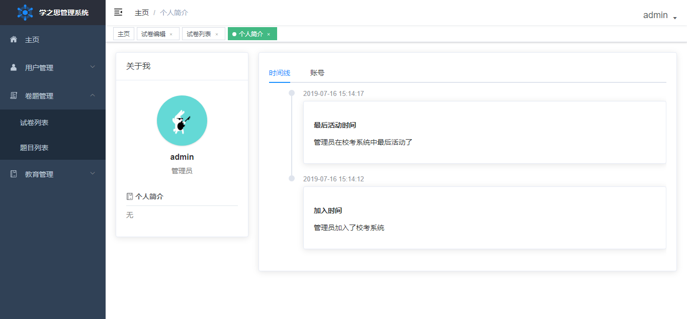
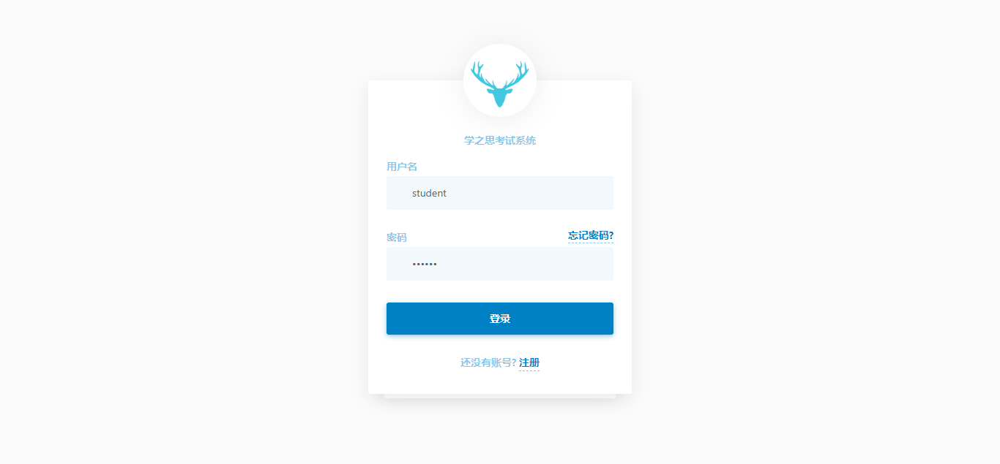
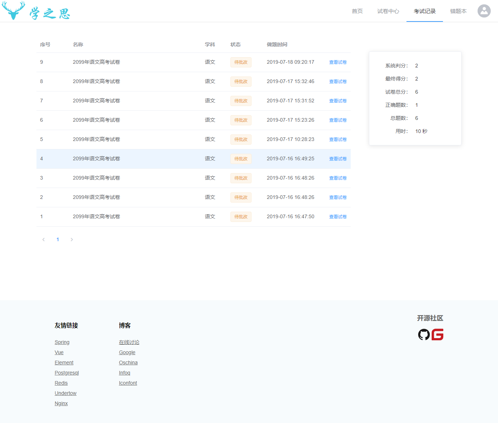
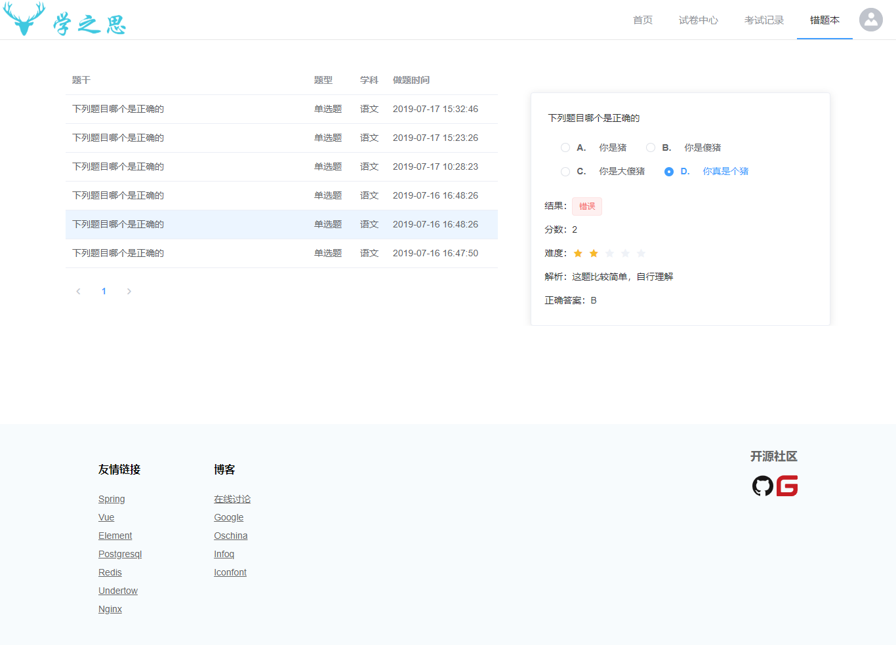
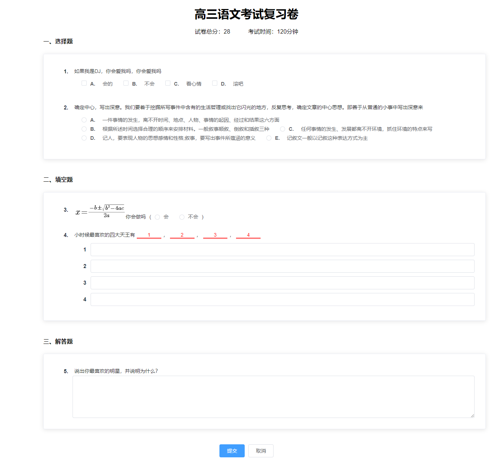
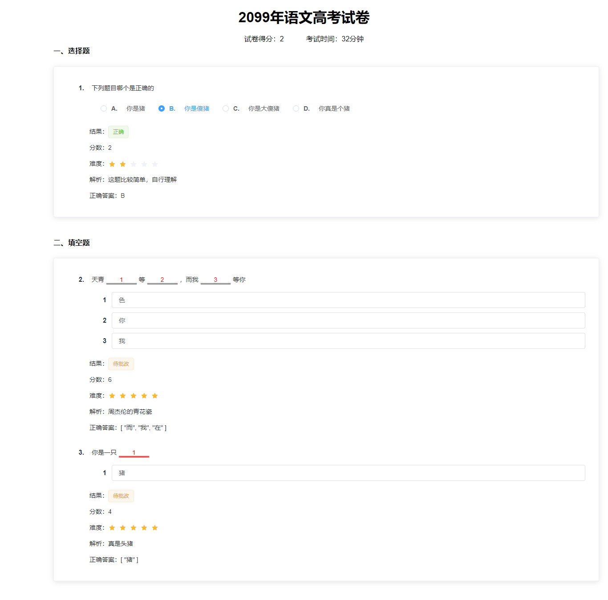

# 学之思考试系统

#### 介绍
学之思考试系统是一款基于k12教育的考试平台，小学、初中、高中和不同学科均可以均可以使用，支持各种题型(单选、多选、判断、填空、解答)，里面包含了三大系统：学生系统、教师系统(TODO)、管理员系统。

演示地址(国外渣服务器，加载慢):  
   1. http://192.243.116.158   考试系统
   2. http://192.243.116.158:81   管理系统
 

学生系统模块：
* 登录、注册： 注册时要选年级，过滤不同年级的试卷， 账号为student/123456
* 首页： 任务中心(TODO)、固定试卷、时段试卷、推送试卷(TODO)，可以能做的一部分试卷
* 试卷中心： 包含了所有能做的试卷，按学科来过滤和分页
* 考试记录： 所有的试卷考试记录在此处分页，可以查看试卷结果、用时、得分、自行批改(TODO)等
* 错题本： 所有做错的题目，可以看到做题的结果、分数、难度、解析、正确答案、扩展练习(TODO)等
* 个人中心： TODO
* 消息： TODO
* 试卷答题和试卷查看： 展示出题目的基本信息和需要填写的内容

管理系统模块：
* 登录： 账号为 admin/123456
* 主页： 包含了试卷、题目、做卷数、做题数的统计功能，做卷和做题会按当月的每天统计
* 用户管理： 对不同角色 学生、教师、管理员 的增删改查
* 卷题管理：
    1. 试卷列表：试卷的增删改查，新增包含选择学科、试卷类型、试卷名称、考试时间，试卷内容包含添加大标题，然后添加题目到此试卷中，组成一套完整的试卷
    2. 题目列表：题目的增删改查，目前题型包含单选题、多选题、判断题、填空题、简单题，支持图片、公式等。

#### 软件架构
系统采用了前后端分离技术,学生、教师、管理员系统前台均使用vue.js, 后台使用spring boot

后端技术栈列表：
* spring-boot  2.1.6.RELEASE
* spring-boot-security 用户登录验证 
* undertow  web容器 
* postgresql 优秀的开源数据库
* redis 缓存，提升系统性能
* mybatis 数据库中间件
* hikari 速度最快的数据库连接池
* fastdfs 文件系统中间件，需自行搭建，存放图片等文件

前端技术栈列表：
* Vue.js  采用新版，使用了vue-cli3搭建的系统，减少大量配置文件
* element-ui  最新版
* vue-element-admin 最新版，对该系统做了大量精简，只保留了部分样式和控件
* echarts 图表统计
* ueditor 为了支持填空题，做了部分修改

#### 安装教程

1. redis 安装
2. fastDfs 安装，[安装教程](https://blog.51cto.com/zhaobotao/2107094)，这里有2点需要注意下：
   1. 单台机器部署 tracker_server 设置为ip地址，不要设置127.0.0.1或者localhost 
   2. 先启动ngix,再启动fastDfs服务，不然端口会被占用
3. postgresql 安装后执行/exam/database下的数据库脚本，创建表初始化数据
4. 下载好源码，
   1. /exam/source/exam为后台代码，建议使用IntelliJ IDEA打开，在application-dev.yml文件中，配置好postgesql、redis、fdfs的服务地址，打开ExamApplication文件编译运行。
   2. /exam/source/vue下为学生端、管理员端的前端代码，建议使用JetBrains WebStorm打开，使用命令：npm run serve即可编译代码

#### 使用说明
1.学之思管理系统

2. 学之思考试系统

#### 系统优化说明

1. 题目试卷等文本信息均存放在t_text_content表中，可换成ElasticSearch来存储，修改TextContentService接口中的实现即可

2. 学生提交的试卷信息均为同步的，提高并发可考虑异步写入，使用Kafka等消息中间件来进行题目结果保存和写入，修改事件监听器CalculateExamPaperAnswerListener中的入库代码即可

3. session使用redis共享，可水平扩展

#### 联系方式
   
    QQ：2693073475
   
    Email: alvis_u@qq.com