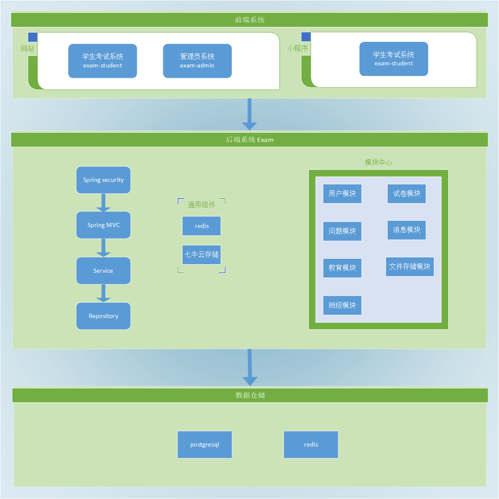

### 运行环境

|  环境   | 版本  |
|  ----  | ----  |
| 操作系统  | Windows / Linux |
| Jdk  | 1.8 |
| Redis  | 6.0 |
| PostgreSql  | 12.0 |

### 后台系统

* spring-boot  2.1.6.RELEASE
* spring-boot-security 用户登录验证
* undertow  web容器
* postgresql 优秀的开源数据库
* redis 缓存，提升系统性能
* mybatis 数据库中间件
* hikari 速度最快的数据库连接池
* 七牛云存储 分布式文件存储中心

### 前台系统

* vue  采用新版，使用了vue-cli4搭建的系统，减少大量配置文件
* element-ui  最流行的vue UI框架
* vue-element-admin 深度定制版
* echarts 图表统计
* ueditor 深度定制版

### 微信小程序

* iView 主题样式

### 架构图

